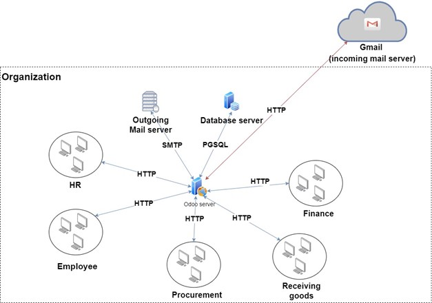
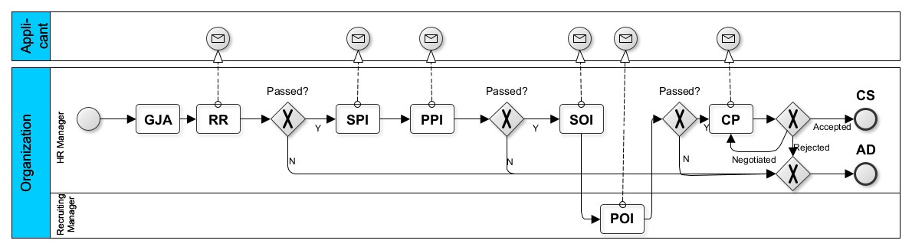
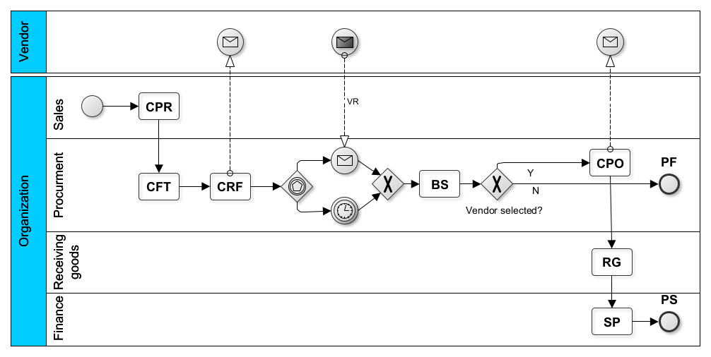

# An uncertainty-aware event log of network traffic

## Online Repository URL
* [DataRepository](https://campushaifaac-my.sharepoint.com/:f:/g/personal/gengel01_campus_haifa_ac_il/ElOfw--h8W5Hl3nfQtiQJSgBOgl1OQt5ugXg4VtY-gDyog?e=30yMdB) - Link to the data repository.

## About Data Sets
These data sets contain a recordings of network traffic data.
The network was recorded while business processes were running on the system. In addition, the data was preprocessed in 4 stages and a classification process was applied on the data from the last level. All the data from raw network data to a fully preprocessed and classified level is included in this repository. 

## About Data collection methodology
The recordings are from a simulation environment which represents a common enterprise communication infrastructure.  
It is composed of multiple servers, endpoints, and applications representing several organizational units. It able to simulate execution of business process cases over an enterprise resource planning(ERP) web application with a relational database backend and an email server. The following figure describes the simulation environment topology:

The network traffic was recorded using [WireShartk](https://www.wireshark.org/).  
There are two types of recording:  

* Recordings of network traffic for training
* Recordings of network traffic for evaluation

### Recordings for Training
Data sets created from "Recordings for Training" are recordings of network traffic while only one business process instance was running for each execution.
As a result, each business process' activity case is running in isolation without other activities running in parallel.
The idea is to have a 'clean' recording of a network traffic so an activity pattern could be investigated for training purposes.
 
### Recordings for Evaluation
Data sets of type "Recordings for Evaluation" are recordings of network traffic while multiple business processes are running in parallel.  
As a result business processes' activities instances are running in concurrency.  
The idea is to have more realistic network traffic recordings to mimic data in real environment.  

### Business Processes 
To generate the data, we defined two business processes: an HR (human resources) recruitment process, and a purchase-to-pay process. 

#### HR recruitment process
The following figure depicts an HR recruitment process that was executed via the simulation environment. A recruitment process starts with a Generate Job Application activity (could be referred as GJA) and holds two final states: Application Dropped (AD) or Contract Signed (CS). It includes the following activities: Resume Review (RR), Schedule a Phone Interview (SPI), Perform a Phone Interview (PPI), Schedule an on-site Interview (SOI), Perform an on-site Interview (POI), and Contract Proposal (CP). 

The following figure depicts the Purchase to Pay process that was executed via the simulation environment. A process starts with a Create Purchase Request (could be referred as CPR) and holds two final states: Purchase Failed (PF) or Purchase Succeeded (PS). It includes the following activities: Create Call for Tender (CFT), Create RFQs (CRF), Vendor Response (VR), Bid Selection (BS), Create Purchase Order (CPO), Receive Goods (RG), and Submit Payment (SP). 

### Preprocessing 
Network traffic data is noisy in its nature and huge in its volume. Thus, we preprocessed the data to remove noise and irrelevant information to obtain a more compact, cleaner, and slightly abstracted data for further analysis. The network data for both data sets (training and evaluation) was preprocessed in four levels:  

* Message type level - representation 1 (R1) - where only TCP packets are kept and mapped to an event log standard form.

* Data access level - representation 2 (R2) - where only packets that have application layer protocols are kept, namely, packets whose protocol is HTTP, SMTP or PGSQL.

* Data access level log and noise cancellation - representation 3 (R3)  - where we filter out noise which relates to network operations that take place regardless of any business activity. This is done based on recordings of the system when no activity execution takes place.

* Database impact level - representation 4 (R4)  - where PGSQL packets that pertain to database operations of INSERT and UPDATE are kept, while other PGSQL packets are removed.

In the resulting dataset, each packet is represented as an event in a stream. The data contains all the events which stand for packets in HTTP and SMTP protocols and all the events which stand for packets in the PGSQL protocol whose query type is INSERT or UPDATE (namely, packets that reflect database update operations).

### Classification
The purpose of the classification was to classify packets from the network data sets to business activities and cases, to form an event log suitable for process mining tasks. We classify the packets as an activity action (i.e., start, end, and NoAction), activity type (i.e., the actual business activity label), and assigned a business processes level case id.
To support the classification, the data from level R4 was further processes for feature engineering: Packets representing HTTP request/response and SQL queries were parsed to extract additional attributes. Those attributes were added to the data sets as additinal columns.
The results of the classification are as follows: all packets in the data are tagged with an activity action i.e., classified as activity start, activity end, or NoAction. The start and end activity actions are also tagged with the activity type e.g., classified as Get Job Application or Review Application and with a case id.
Since the classification holds probability, we included the probability of the classification.

### Description of the data
The data sets are stored in a flat zip files structure.

* TRAIN.zip - contains the data for the HR recruitment business process (BP) from the recordings for training (each BP running in isolation)
* VALID.zip - contains the data for the Purchase to Pay (PTP) business process (BP) from the recordings for training (each BP running in isolation)
* TEST.zip -  contains the data for the both PTP and HR business processes from the recordings for training (each BP running in isolation)
* HR-INTERLEAVED.zip - contains the data for the HR recruitment business process from the recordings for evaluation (BPs are running in concurrency)
* PTP-INTERLEAVED.zip - contains the data for the Purchase to Pay (PTP) business process from the recordings for evaluation (BPs are running in concurrency)
* recognition_results.zip - contains data sets for both the PTP and HR BPs after feature engineering stage and classification. The results are presented as probability distribution to supply data for uncertainty research
* UNCERTAIN_XES_LOGS - XES formatting of the data in recognition_results.
* BPMN_GROUND_TRUTH.zip - contains a BPMN represenation of the executed business processes (could be served as a ground truth for a log abstraction task) 
* LICENCE.md - self explainatory
* README.md - this file

#### Inner folder structure:
TEST, TRAIN, VALID, HR-INTERLEAVED and PTP-INTERLEAVED share the same inner folder structure. Each folder stands for a level of prepossessing as described in the Preprocessing section above.
Each zip files contains the following folders and files:

* Zip file name (root folder)
    * R1 - The data after the level 1 of the prepossessing in csv and pkl format
        * R1.csv 
        * R1.pkl
    * R2 - The data after the level 2 of the prepossessing in csv and pkl format
        * R2.csv 
        * R2.pkl
    * R3 - The data after the level 3 of the prepossessing in csv and pkl format
        * R3.csv 
        * R3.pkl
    * R4 - The data after the level 4 of the prepossessing in csv and pkl format
        * R4.csv 
        * R4.pkl

#### recognition_results:
recognition_results.zip contains the R4 files from the recordings for evaluations (BPs are running in concurrency) after feature engineering and classification. 
It contains the following folder structure and files: 

* recognition_results
    * hr_data_anonymize_recognition_results.csv - classification results for the HR recruitment business process.  
    * ptp_data_anonymize_recognition_results.csv- classification results for the Purchase to Pay business process.

#### Schema:
All files share the same schema except the recognition_results (which will be describe later in this file)
The files contains the following schema:

| Field name      | Field Description                                                                                                                                                                                                                                                                                                     |
| ----------- |-----------------------------------------------------------------------------------------------------------------------------------------------------------------------------------------------------------------------------------------------------------------------------------------------------------------------|
|FileName | Name of the recording file this data is originated from.                                                                                                                                                                                                                                                              |
|BusinessActivity | Contains the name of the business process activity. This column contains data only for the training data set, the evaluation data set has the value of the business process since the activity is unknown.                                                                                                            |
|InstanceNumber | Contains the case id of the business process (instance number). This column contains data only for the training data set, the evaluation data set contains garbage value in this column since the case id is unknown.                                                                                                 |
|sniff_time | The recording time (used as a time stamp)                                                                                                                                                                                                                                                                             |
| frame.number | The order of the packets in the data (added by wireshark)                                                                                                                                                                                                                                                             |
| synthetic_sniff_time	 | Since the interval between packets is very low (milliseconds) and most of the analytics tools are sensitive to micro seconds granularity, we manipulated the sniffing time to show difference between packets even in macro seconds granularity, while keeping the original relative time between packets.            | 
| synthetic_sniff_time_str | A string representation of synthetic_sniff_time.                                                                                                                                                                                                                                                                      |
| session_generalized | A string combination of the actors participated in the session.                                                                                                                                                                                                                                                       |
| HighestLayerProtocol | Contain the protocol name of the highest layer e.g HTTP, PGSQL etc.                                                                                                                                                                                                                                                   |
| MessageType_WithRole | Contains a string representation of the source machine role, the destination machine role and the type of message they exchanged. e.g. End Point (HR Manager)->Odoo Application:[HttpRequest:POST /xmlrpc/2/common HTTP/1.1\r\n]                                                                                      | 
| MessageType | The type of the message exchanged in this packet. e.g. PgsqlRequest:Simple query                                                                                                                                                                                                                                      |
| MessageAttributes	 | The attributes transferred in this packet. In the feature engineering phase, this column is parsed to extract additional attributes. **MessageAttributes column was omitted from the recognition_results data sets"                                                                                                   |
| query_type | Contais the type of query (INSERT, UPDATE) for the PGSQL packets. Empty for HTTP packets.                                                                                                                                                                                                                             |
| session_class	 | Protocol name (http, pgsql, smtp) exist from R2 and above.                                                                                                                                                                                                                                                            |
| filter_flag | Left over from the filtering stages contains the value True from R2 and above.                                                                                                                                                                                                                                        |
| query	 | For PGSQL packets, contains the query for the data base. HTTP packets has no value. applicable for R2 and above.                                                                                                                                                                                                      |
| tables | For PGSQL packets, contains the list of tables impacted by this packets. exist from R2 and above.                                                                                                                                                                                                                     |
| event	 | A concise string representation of the message carried out in this packet. e.g. PgsqlRequest:Simple query:SELECT:['pg_database']. Exist from R2 and above.                                                                                                                                                            |
| event_with_roles	 | A concise str representation of the source, destination, message and roles in this packet. e.g. Odoo Application->db Server/Mail Server: [PgsqlRequest:Simple query:SELECT:['base_registry_signaling', 'base_cache_signaling']] .Exist from R2 and above. **This column was hevely used in the classification phase** |
| noise_event | Left over from the filtering stages, a flag to mark packets as noise.                                                                                                                                                                                                                                                 |

#### recognition_results schema:
The schema described above was extended for the recognition_results. We added additional columns at the feature engineering stage and at the classification stage. 

##### parsing PGSQL
At the feature engineering stage we extract over 100 attributes from packets representing PGSQL and HTTP. The list of attributes is too long to be presented here but we can give some examples:
For a PGSQL packet containing the following query 

    INSERT INTO "res_users_log" ("id", "create_uid", "create_date", "write_uid", "write_date") VALUES (nextval('res_users_log_id_seq'), 6, (now() at time zone 'UTC'), 6, (now() at time zone 'UTC')) RETURNING id
We extracted the following columns and values :

* id = nextval('res_users_log_id_seq')
* create_uid =   6  
* create_date = now() at time zone 'UTC'
* write_uid = 6
* write_date =  now() at time zone 'UTC'

##### parsing HTTP
We did the same for the message attributes column from the HTTP packets. When it contained request/response parameters, we parsed the message and extracted parameters and their values as additional columns. Not all parameters were selected.
As an example, for an HTTP packet containing the following request parameter xml:
    
    <methodCall>
        <methodName>execute_kw
            <params>
                <param><value>odoo01</param>
                <param><value>6</param>
                <param><value>123456789</param>
                <param><value>hr.applicant</param>
                <param><value>create</param>
                <param><value><value>
                    <member><name>name<value>Head of Research</member>
                    <member><name>partner_name<value>Daniel Duncan</member>
                    <member><name>email_from<value>daniel.duncan@gmail.com</member>
                    <member><name>job_id<value>4</member></struct></data></param>
            </params>
    </methodCall>

We extracted the following columns and values :

* request_method_call = execute_kw
* file_data =   ['execute_kw', 'odoo01', '6', '123456789', 'hr.applicant', 'create', 'name', 'Head of Research', 'partner_name', 'Daniel Duncan', 'email_from', 'daniel.duncan@gmail.com', 'job_id', '4']  
* selective_filter_data = hr.applicant_create

##### Classification results
We used sequence modeling as the classification method. This means we had to form sequences as input to the classification model. For the training data, we formed the sequences by grouping the BusuinessActivity and InstanceNumber columns. But for the evaluation data the values of those columns are not known. So to form sequences we chose the following method: First we identify the start and end packets of an activity using the activity action model. Then for each packet identified as an activity action, we form a sequence by opening a window forward and backwards. The size of the window is a hyper-parameter to experiment with. For the recognition_results we created tree types of sequences. Each have its own column.

* classification_prob_windows_start-41_end-7_action_1 - a sequence created with a window of (41, 7, 1) -  41 packets forward and 7 packets backwards. The activity action was identify with a sequence of size 1.
* classification_prob_windows_start-15_end-15_action_1 - a sequence created with a window of (15, 15, 1) 15 packets forward and 15 packets backwards. The activity action was identify with a sequence of size 1.
* classification_prob_windows_start-7_end-41_action_1 - a sequence created with a window of (7, 41, 1) 7 packets forward and 41 packets backwards. The activity action was identify with a sequence of size 1.

The classification result is a dictionary contains an activity and the probability of this packet to be classified as the activity. i.e.: 

    {'ResumeReviewActivity': 0.384322532584433, 
    'GenerateJobApplicationActivity': 0.1843477633451853, 
    'PerformAnInterviewMeeting': 4.7399447586012736e-14, 
    'PerformAnInterviewCall': 2.407567933598791e-34, 
    'ScheduleAnInterviewActivityCall': 1.280111885616518e-21, 
    'ScheduleAnInterviewMeeting': 1.6039484157515345e-17, 
    'ContractProposal': 8.29100569383624e-35}

    From the above example we can see the highest probability is for the ResumeReviewActivity.

### Distribution of datasets in the uncertainty-extended XES data standard

In addition to distributing the CSV files for the recognition_result logs, we additionally share two files containing the same datasets converted to an XES extension explicitly representing uncertainty in event attributes. Specifically, in such files there are three uncertain event attributes, which correspond to the result of the label inference described above:

- classification_prob_windows_start-41_end-7_action_1
- classification_prob_windows_start-15_end-15_action_1
- classification_prob_windows_start-7_end-41_action_1

The XES uncertain log retains all three, but maps classification_prob_windows_start-41_end-7_action_1 with the activity label notion (easily changed by remapping the attribute names).
Uncertain attributes fully express a probabilistic description of attribute values. In the case of the aforementioned three attributes, they are discrete and expressed through a discrete probability distribution.

The example of classification shown in the previous section would be converted as such in the XES file:

	<string key="uncertainty:classification_prob_windows_start-15_end-15_action_1" value="discrete_weak">
		<float key="ResumeReviewActivity" value="0.384322532584433" />
		<float key="GenerateJobApplicationActivity" value="0.1843477633451853" />
		<float key="PerformAnInterviewMeeting" value="4.7399447586012736e-14" />
		<float key="PerformAnInterviewCall" value="2.407567933598791e-34" />
		<float key="ScheduleAnInterviewActivityCall" value="1.280111885616518e-21" />
		<float key="ScheduleAnInterviewMeeting" value="1.6039484157515345e-17" />
		<float key="ContractProposal" value="8.29100569383624e-35" />
	</string>

The structure shown here for the representation of uncertainty leverages the meta-attribute model present in the XES standard. As such, all XES-certified process analysis tools are able to read and write the probability values for the possible labels. Uncertainty-focused process mining tools are able to exploit this probabilistic information to provide additional insights about the process on the basis of ad-hoc techniques.

In order to allow traditional process mining tools to have maximum compatibility with this class of logs, we introduced default values for such attributes. The default values corresponds to the label with highest probability, i.e., `ResumeReviewActivity` in the example above.

Withing an existing taxonomic classification for event logs, this log is of class [A]W (meaning there is a discrete and "weak" uncertainty, i.e. the probability values are known, on the activity label attribute).

The following table shows some statistics of the event logs.

| **Statistic**                               | **Log**            | **Log**            |
|---------------------------------------------|--------------------|--------------------|
|                                             | HR                 | PTP                |
|---------------------------------------------|--------------------|--------------------|
| Number of traces                            | 10                 | 10                 |
| Number of events                            | 74                 | 126                |
| Number of unique activity labels            | 7                  | 7                  |
| Average number of events per trace          | 7.4                | 12.6               |
| Median number of events per trace           | 6.0                | 14.0               |
| Minimum number of events per trace          | 4                  | 8                  |
| Maximum number of events per trace          | 14                 | 14                 |
|---------------------------------------------|--------------------|--------------------|
| Taxonomic classification                    | [A]W    | [A]W    |
| Average number of realizations per trace    | 10,084,532,298.4   | 7,344,521,182.6    |
| Median number of realizations per trace     | 412,972.0          | 7,909,306,972.0    |
| Minimum number of realizations per trace    | 2,401              | 823,543            |
| Maximum number of realizations per trace    | 96,889,010,407     | 13,841,287,201     |
| Total number of trace realizations          | 100,845,322,984    | 73,445,211,826     |

Here, by "realization" we mean the number of possible traditional traces obtained from all possible samplings of the uncertain activity label attributes. We can see that, even though this log contains data about 10 cases, it expresses a high amount of complexity.

For further reading:

- Pegoraro, Marco, Merih Seran Uysal, and Wil MP van der Aalst. "Conformance checking over uncertain event data." Information Systems 102 (2021): 101810.
- Pegoraro, Marco, Merih Seran Uysal, and Wil MP van der Aalst. "An XES Extension for Uncertain Event Data." In International Conference on Business Process Management. 2021.
- Pegoraro, Marco, Merih Seran Uysal, and Wil MP van der Aalst. "PROVED: A tool for graph representation and analysis of uncertain event data." In Application and Theory of Petri Nets and Concurrency: 42nd International Conference, PETRI NETS 2021, Virtual Event, June 23–25, 2021, Proceedings 42, pp. 476-486. Springer International Publishing, 2021.
    
##### Tagging ground truth for evaluation 
Additionally, the data was manually inspected and tagged as ground truth for evaluation purposes. Not all packets could be traced for the original classification. However, we could trace the classification for the packets of the activity action.

We now describe the important columns in the recognition_results schema:

* activities - contains the list of active activities at each packet. This column was added for evaluation, when an activity starts, it is added to the list of activities in the columns. When it ends, it is removed.
* stream_index - added by wireshark, keeps an id of active TCP connection. Packets which share a TCP connection will have the same stream_index.
* request_method_call - the method call extracted from the message attributes for HTTP packets.
* starting_frame_number - for http response packets, contain the frame.number of the request packet.
* file_data - the list of parameters extracted from the message attributes for HTTP packets.
* activities_with_bp - same as the activities column but keeps a number for case id for each activity.
* CaseId - classification results for the case id.
* real_activity_action - results of the manual inspection for ground truth tagging. Contains the real activity type with the activity action e.g GenerateJobApplicationActivity Start.
* real_single_activity_action - results of the manual inspection for ground truth tagging. Contains the real activity action e.g Activity Start, Activity End and NoAction
* real_case_id - contains an id of an attribute representing the case id. For the HR recruitment it's the value of hr_applicant_id and for the purchase to pay it the value of sale_order_id. Never the less, the value can be treated as a number indicating a case instance.
* selective_filter_data - a selective set of attributes from the file_data column. Those attributes were selected as part of the feature engineering stage.
* origin_request_method - for response packets, contains the value of the request_method in the request packet.
* origin_selective_filter_data - for response packets, contains the value of the selective_filter_data in the request packet.
* activity_action_classification - results of the activity action classification, contains the classification of the packet to Activity Start, Activity End  or NoAction.
* classification_prob_windows_start-41_end-7_action_1 - results of the activity classification with probability for sequences created with window (41, 7, 1) as described above.
* classification_prob_windows_start-15_end-15_action_1 -  results of the activity classification with probability for sequences created with window (15, 15, 1) as described above.
* classification_prob_windows_start-7_end-41_action_1 -  results of the activity classification with probability for sequences created with window (7, 41, 1) as described above.

Further details about the data extraction can be found in:

* G. Engelberg, M. Hadad, P. Soffer, From network traffic data to business activities: A
process mining driven conceptualization, in: Enterprise, Business-Process and Information
Systems Modeling - 22nd International Conference, BPMDS 2021, and 26th International
Conference, EMMSAD 2021, Held at CAiSE 2021, Melbourne, VIC, Australia, June 28-29,
2021, Proceedings, volume 421 of Lecture Notes in Business Information Processing, Springer,
2021, pp. 3–18.
* M. Hadad, G. Engelberg, P. Soffer, From network traffic data to a business-level event
log, in: Enterprise, Business-Process and Information Systems Modeling - 24nd Interna-
tional Conference, BPMDS 2023, Held at CAiSE 2023, Zaragoza, Spain, June 12-16, 2023,
Proceedings, 2023.

## Contributors

* **Gal Engelberg**  - Accenture Labs | University of Haifa, Israel
* **Moshe Hadad**    - Accenture Labs | University of Haifa, Israel
* **Marco Pegoraro** - RWTH Aachen University
* **Pnina Soffer**   - Univeristy of Haifa
* **Ethan Hadar**    - Accenture Labs, Israel
* **Wil M.P. van der Aalst**    - RWTH Aachen University

## License

This work is licensed under a
[Creative Commons Attribution-NonCommercial-ShareAlike 4.0 International License][cc-by-nc-sa].

[![CC BY-NC-SA 4.0][cc-by-nc-sa-image]][cc-by-nc-sa]

[cc-by-nc-sa]: http://creativecommons.org/licenses/by-nc-sa/4.0/
[cc-by-nc-sa-image]: https://licensebuttons.net/l/by-nc-sa/4.0/88x31.png
[cc-by-nc-sa-shield]: https://img.shields.io/badge/License-CC%20BY--NC--SA%204.0-lightgrey.svg\]

## Acknowledgments
This work was done in collaboration with Accenture Labs, Israel
